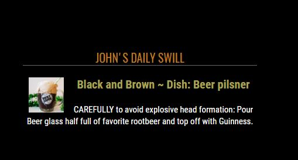
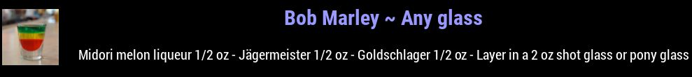
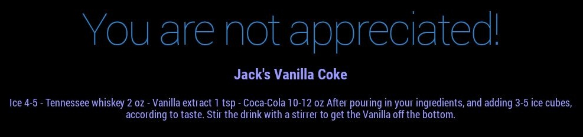

# MMM-Cocktails
A MagicMirror module that teaches you how to make all kinds of mixed drinks.

Works by default with Hello-Lucy voice enhancement!

## Examples

maxWidth: 400px, colored title text. Good for left and right regions.

maxWidth: 1050px, colored title text. Increased text sizes. top/bottom_bar, upper/lower_third, middle_center.

No picture, colored title and body text. Placed under the compliments module as an example. Make it yours!

## Info

* Completely configurable. The .css file included helps you modify size of image, text, color, any way you like it.
* For best results in left or right regions constrain the size using maxWidth and the .css examples provided.
* For best results in top_bar/bottom_bar/thirds increase maxWidth to stretch across your mirror and modify css.
* Need a color chart? No problem. http://htmlcolorcodes.com/color-picker/
* No API key is necessary at the moment.

## Installation

* `git clone https://github.com/mykle1/MMM-Cocktails.git` into the `~/MagicMirror/modules` directory.

## Add to Config.js

    {
        module: "MMM-Cocktails",
        position: "top_left", // Editable footprint - Fits anywhere.
        config: {
            maxWidth: "400px",     // See provided .css file for full customization options
            header: "",
        }
    },

## Config Options

| **Option** | **Default** | **Description** |
| --- | --- | --- |
| `maxWidth` | `400px` | Constrain, or stretch across top_bar,bottom_bar, thirds. |
| `header` | `text` | I'm not a fan of headers but the option is yours. |
| `animationSpeed` | `3000` | The speed at which the new cocktail fades in ms. |
| `updateInterval` | `10*60*1000` | New drink every 10 minutes. |
| `initialLoadDelay` | `1250` | Module load delay in ms. |
| `retryDelay` | `2500`  |Delay to retry fetching data. |
